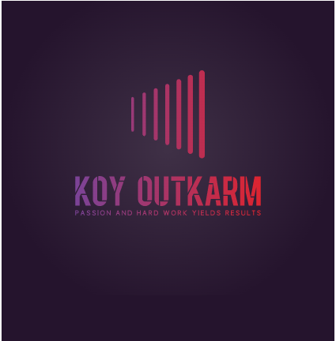

<a name="readme-top"></a>

<div align="center">

  <h1><b>Remontada API</b></h1>
  <p>⚙️ A Ruby on Rails API backend powering the KoyOutkarm Portfolio and future AI-enhanced features.</p>
</div>

---

## 📚 Table of Contents

- [📖 About the Project](#about-the-project)
  - [🎯 Purpose](#purpose)
  - [🧰 Built With](#built-with)
  - [🚀 Live API](#live-api)
- [💻 Getting Started](#getting-started)
  - [⚙️ Setup](#setup)
  - [📦 Installation](#installation)
  - [🗄️ Database Configuration](#database-configuration)
  - [▶️ Usage](#usage)
  - [🚢 Deployment](#deployment)
- [🧩 Features](#features)
- [🛣️ API Endpoints](#api-endpoints)
- [👥 Author](#author)
- [🤝 Contributing](#contributing)
- [⭐️ Support](#support)
- [🙏 Acknowledgements](#acknowledgements)
- [❓ FAQ](#faq)
- [📝 License](#license)

---

## 📖 About the Project <a name="about-the-project"></a>

### 🎯 Purpose <a name="purpose"></a>

**Remontada API** is the backend service for the KoyOutkarm Portfolio. It is built using Ruby on Rails and provides RESTful endpoints for managing projects and developer content. It is structured for extensibility, performance, and future integration with AI workflows.

---

## 🧰 Built With <a name="built-with"></a>

- **Language:** Ruby
- **Framework:** Ruby on Rails
- **Database:** PostgreSQL
- **Hosting:** Render
- **Version Control:** Git & GitHub

---

## 🚀 Live API <a name="live-api"></a>

🌐 **Base URL:**  
[`https://remontada-api.onrender.com`](https://remontada-api.onrender.com)

---

## 💻 Getting Started <a name="getting-started"></a>

Follow the steps below to run the API locally for development or testing.

---

### ⚙️ Setup <a name="setup"></a>

Clone the backend repository:

```bash
git clone https://github.com/Outkarm/remontada-api.git
cd remontada-api
```

---

### 📦 Installation <a name="installation"></a>

Install Ruby dependencies:

```bash
bundle install
```

Install required JS packages (if applicable):

```bash
yarn install
```

---

### 🗄️ Database Configuration <a name="database-configuration"></a>

Make sure PostgreSQL is running on your machine.

Then set up the database:

```bash
rails db:create
rails db:migrate
```

(Optional: seed sample data)

```bash
rails db:seed
```

---

### ▶️ Usage <a name="usage"></a>

Start the development server:

```bash
rails server
```

The API will be accessible at:

```http
http://localhost:3000
```

Use tools like [Postman](https://www.postman.com/) or [Insomnia](https://insomnia.rest/) to test endpoints.

---

### 🚢 Deployment <a name="deployment"></a>

This backend is deployed on **Render**. To deploy your own:

1. Create a new service on [Render](https://render.com/).
2. Connect your GitHub repository.
3. Set the build and start commands:

```bash
Build Command: bundle install && yarn install && rails db:migrate
Start Command: bundle exec rails server
```

4. Add necessary environment variables (e.g., `DATABASE_URL`, `RAILS_ENV`).

---

## 🧩 Features <a name="features"></a>

- ✅ RESTful API structure
- 🔐 Secure with CORS and strong parameters
- 🧠 Built for future AI workflow support
- 📂 Organized by controllers and models
- 📡 Live deployed API on Render

---

## 🛣️ API Endpoints <a name="api-endpoints"></a>

> 📌 _This is a sample list. Update with actual endpoints from your app._

| Method | Endpoint            | Description          |
| ------ | ------------------- | -------------------- |
| GET    | `/api/projects`     | List all projects    |
| POST   | `/api/projects`     | Create a new project |
| GET    | `/api/projects/:id` | Get a single project |
| PATCH  | `/api/projects/:id` | Update a project     |
| DELETE | `/api/projects/:id` | Delete a project     |

> 🔧 Add authentication and nested routes if applicable

---

## 👥 Author <a name="author"></a>

👤 **John Kpordje**

- GitHub: [@Outkarm](https://github.com/Outkarm)
- Twitter: [@outkarm](https://twitter.com/outkarm)
- LinkedIn: [John Kpordje](https://www.linkedin.com/in/john-kpordje-866749241/)

---

## 🤝 Contributing <a name="contributing"></a>

Contributions and improvements are welcome!

To contribute:

```bash
1. Fork the repository
2. Create your feature branch: git checkout -b feature/your-feature
3. Commit your changes: git commit -m 'Add your message'
4. Push to the branch: git push origin feature/your-feature
5. Open a pull request
```

---

## ⭐️ Support <a name="support"></a>

If you like this project, please give it a ⭐️ on GitHub to show support and help others find it.

---

## 🙏 Acknowledgements <a name="acknowledgements"></a>

- Ruby on Rails community
- Render for hosting
- PostgreSQL for database reliability
- You, for checking out this repo!

---

## ❓ FAQ <a name="faq"></a>

**Q: Can I integrate this API with my own frontend?**  
A: Yes! This is a standard RESTful API and can be consumed by any frontend framework like React, Vue, or Angular.

**Q: How do I reset the database?**  
A: Run:

```bash
rails db:drop db:create db:migrate db:seed
```

**Q: Where can I see the live backend?**  
A: It’s hosted at: [`https://remontada-api.onrender.com`](https://remontada-api.onrender.com)

---

## 📝 License <a name="license"></a>

This project is licensed under the [MIT License](./LICENSE).

<p align="right">(<a href="#readme-top">back to top</a>)</p>
